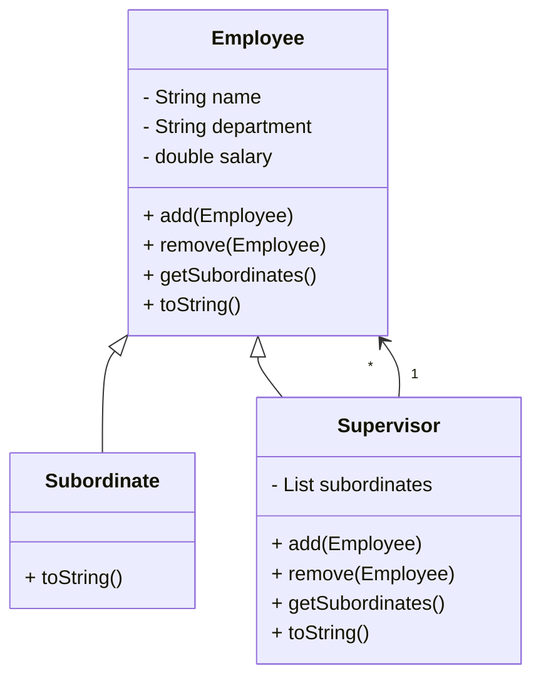

# Composite Design Pattern in Java

The **Composite Design Pattern** is a structural pattern that lets you compose objects into tree structures to represent part-whole hierarchies.  
It allows clients to treat individual objects (leaves) and compositions of objects (composites) uniformly.

---

## Structure

- **Component (`Employee`)**
    - Declares the common interface for both simple (leaf) and complex (composite) objects.
    - Provides default implementations of `add`, `remove`, and `getSubordinates` which throw exceptions for leaves.
    - Defines common attributes (`name`, `department`, `salary`).

- **Leaf (`Subordinate`)**
    - Represents the end objects of a composition.
    - Cannot have subordinates (children).
    - Inherits default behavior of `add/remove` which throw exceptions.

- **Composite (`Supervisor`)**
    - Represents nodes that can have children.
    - Stores child components (`List<Employee>`).
    - Implements `add`, `remove`, and `getSubordinates`.

---

## UML (Mermaid Diagram)



---

## Java Implementation

### Component

```java
public abstract class Employee {
    protected String name;
    protected String department;
    protected double salary;

    protected Employee(String name, String department, double salary) {
        this.salary = salary;
        this.department = department;
        this.name = name;
    }

    public void add(Employee e) {
        throw new UnsupportedOperationException("Leaf nodes can't add employees");
    }

    public void remove(Employee e) {
        throw new UnsupportedOperationException("Leaf nodes can't remove employees");
    }

    public List<Employee> getSubordinates() {
        throw new UnsupportedOperationException("Leaf nodes don't have subordinates");
    }

    public abstract String toString();
}
```

### Leaf

```java
public class Subordinate extends Employee {
    public Subordinate(String name, String department, double salary) {
        super(name, department, salary);
    }

    @Override
    public String toString() {
        return "Subordinate: [Name: " + name + ", Department: " + department + ", Salary: " + salary + "]";
    }
}
```

### Composite

```java
import java.util.*;

public class Supervisor extends Employee {
    private final List<Employee> subordinates;

    public Supervisor(String name, String department, double salary) {
        super(name, department, salary);
        subordinates = new ArrayList<>();
    }

    @Override
    public void add(Employee employee) {
        subordinates.add(employee);
    }

    @Override
    public void remove(Employee employee) {
        subordinates.remove(employee);
    }

    @Override
    public List<Employee> getSubordinates() {
        return Collections.unmodifiableList(subordinates);
    }

    @Override
    public String toString() {
        StringBuilder sb = new StringBuilder(
            "Supervisor: [Name: " + name + ", Department: " + department + ", Salary: " + salary + "]"
        );
        for (Employee e : subordinates) {
            sb.append("\n   -> ").append(e.toString());
        }
        return sb.toString();
    }
}
```

### Client

```java
public class Main {
    public static void main(String[] args) {
        Employee ahmed = new Subordinate("Ahmed", "IT", 2000);
        Employee hoda = new Subordinate("Hoda", "IT", 4000);
        Employee marwa = new Subordinate("Marwa", "IT", 4000);
        Employee amgad = new Subordinate("Amgad", "IT", 8000);

        Supervisor mohamed = new Supervisor("Mohamed", "IT", 10000);
        mohamed.add(ahmed);
        mohamed.add(hoda);
        mohamed.add(marwa);
        mohamed.add(amgad);

        System.out.println(mohamed.toString());
    }
}
```

---

## Example Output

```
Supervisor: [Name: Mohamed, Department: IT, Salary: 10000.0]
   -> Subordinate: [Name: Ahmed, Department: IT, Salary: 2000.0]
   -> Subordinate: [Name: Hoda, Department: IT, Salary: 4000.0]
   -> Subordinate: [Name: Marwa, Department: IT, Salary: 4000.0]
   -> Subordinate: [Name: Amgad, Department: IT, Salary: 8000.0]
```

---

## Benefits

- Treats **individual objects** and **compositions of objects** uniformly.
- Simplifies client code (no need to distinguish between leaf and composite explicitly).
- Makes it easy to add new leaf or composite types without changing client code.

---

## When to Use

- When you want to represent **part-whole hierarchies**.
- When you want clients to treat individual objects and groups of objects **the same way**.

---