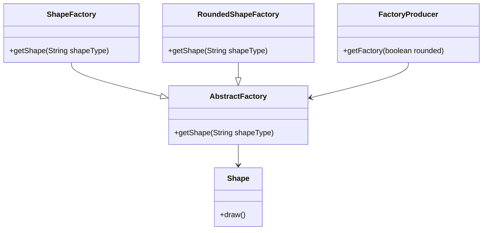

# 🏭 Abstract Factory Pattern

The **Abstract Factory Pattern** provides an interface for creating families of related objects without specifying their concrete classes.  
It is also known as the *Factory of Factories*.

---

## 📖 Explanation

- Creates a super-factory to produce other factories.  
- Each factory can produce related objects without exposing creation logic.  
- Client uses the same interface to create objects from different families.

---

## 🏗️ UML Diagram (Mermaid)


---

## 💻 Java Implementation

### Step 1: Shape Interface
```java
public interface Shape {
   void draw();
}
```

### Step 2: Concrete Shape Classes
```java
public class Rectangle implements Shape {
   @Override
   public void draw() {
      System.out.println("Inside Rectangle::draw() method.");
   }
}

public class Square implements Shape {
   @Override
   public void draw() {
      System.out.println("Inside Square::draw() method.");
   }
}

public class RoundedRectangle implements Shape {
   @Override
   public void draw() {
      System.out.println("Inside RoundedRectangle::draw() method.");
   }
}

public class RoundedSquare implements Shape {
   @Override
   public void draw() {
      System.out.println("Inside RoundedSquare::draw() method.");
   }
}
```

### Step 3: Abstract Factory Class
```java
public abstract class AbstractFactory {
   abstract Shape getShape(String shapeType);
}
```

### Step 4: Concrete Factory Classes
```java
public class ShapeFactory extends AbstractFactory {
   @Override
   public Shape getShape(String shapeType){
      if(shapeType.equalsIgnoreCase("RECTANGLE")){
         return new Rectangle();
      } else if(shapeType.equalsIgnoreCase("SQUARE")){
         return new Square();
      }
      return null;
   }
}

public class RoundedShapeFactory extends AbstractFactory {
   @Override
   public Shape getShape(String shapeType){
      if(shapeType.equalsIgnoreCase("RECTANGLE")){
         return new RoundedRectangle();
      } else if(shapeType.equalsIgnoreCase("SQUARE")){
         return new RoundedSquare();
      }
      return null;
   }
}
```

### Step 5: Factory Producer
```java
public class FactoryProducer {
   public static AbstractFactory getFactory(boolean rounded){
      if(rounded){
         return new RoundedShapeFactory();
      } else {
         return new ShapeFactory();
      }
   }
}
```

### Step 6: Demo Class
```java
public class AbstractFactoryPatternDemo {
   public static void main(String[] args) {
      AbstractFactory shapeFactory = FactoryProducer.getFactory(false);
      Shape shape1 = shapeFactory.getShape("RECTANGLE");
      shape1.draw();
      Shape shape2 = shapeFactory.getShape("SQUARE");
      shape2.draw();

      AbstractFactory roundedFactory = FactoryProducer.getFactory(true);
      Shape shape3 = roundedFactory.getShape("RECTANGLE");
      shape3.draw();
      Shape shape4 = roundedFactory.getShape("SQUARE");
      shape4.draw();
   }
}
```

---

## 🎯 Output
```
Inside Rectangle::draw() method.
Inside Square::draw() method.
Inside RoundedRectangle::draw() method.
Inside RoundedSquare::draw() method.
```
