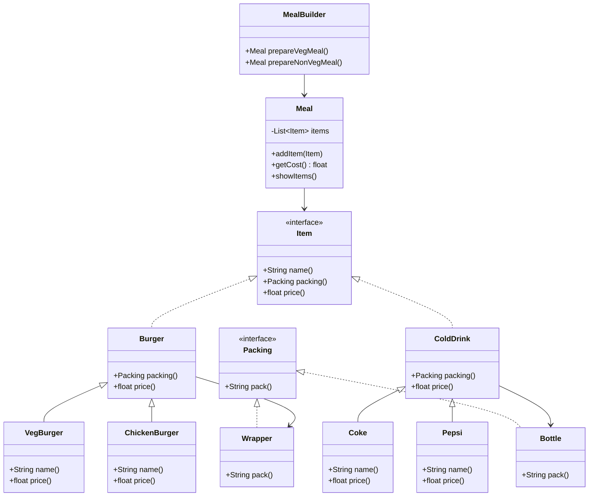

# 🏗️ Builder Pattern

The **Builder Pattern** builds a complex object using simple objects and a **step-by-step approach**.  
It comes under the **creational design patterns** category.

---

## 📖 Definition
- Separates the construction of a complex object from its representation.
- The same construction process can create different representations.
- Example: Building different meal combos in a fast-food restaurant.

---

## 🏗️ UML Diagram (Mermaid)


---

## 💻 Implementation

### Step 1: Interfaces
```java
public interface Item {
   public String name();
   public Packing packing();
   public float price();	
}

public interface Packing {
   public String pack();
}
```

### Step 2: Packing Implementations
```java
public class Wrapper implements Packing {
   @Override
   public String pack() {
      return "Wrapper";
   }
}

public class Bottle implements Packing {
   @Override
   public String pack() {
      return "Bottle";
   }
}
```

### Step 3: Abstract Classes
```java
public abstract class Burger implements Item {
   @Override
   public Packing packing() {
      return new Wrapper();
   }
   @Override
   public abstract float price();
}

public abstract class ColdDrink implements Item {
   @Override
   public Packing packing() {
      return new Bottle();
   }
   @Override
   public abstract float price();
}
```

### Step 4: Concrete Items
```java
public class VegBurger extends Burger {
   @Override
   public float price() { return 25.0f; }
   @Override
   public String name() { return "Veg Burger"; }
}

public class ChickenBurger extends Burger {
   @Override
   public float price() { return 50.5f; }
   @Override
   public String name() { return "Chicken Burger"; }
}

public class Coke extends ColdDrink {
   @Override
   public float price() { return 30.0f; }
   @Override
   public String name() { return "Coke"; }
}

public class Pepsi extends ColdDrink {
   @Override
   public float price() { return 35.0f; }
   @Override
   public String name() { return "Pepsi"; }
}
```

### Step 5: Meal Class
```java
import java.util.ArrayList;
import java.util.List;

public class Meal {
   private List<Item> items = new ArrayList<Item>();	

   public void addItem(Item item){
      items.add(item);
   }

   public float getCost(){
      float cost = 0.0f;
      for (Item item : items) {
         cost += item.price();
      }		
      return cost;
   }

   public void showItems(){
      for (Item item : items) {
         System.out.print("Item : " + item.name());
         System.out.print(", Packing : " + item.packing().pack());
         System.out.println(", Price : " + item.price());
      }		
   }	
}
```

### Step 6: MealBuilder
```java
public class MealBuilder {

   public Meal prepareVegMeal (){
      Meal meal = new Meal();
      meal.addItem(new VegBurger());
      meal.addItem(new Coke());
      return meal;
   }   

   public Meal prepareNonVegMeal (){
      Meal meal = new Meal();
      meal.addItem(new ChickenBurger());
      meal.addItem(new Pepsi());
      return meal;
   }
}
```

### Step 7: Demo Class
```java
public class BuilderPatternDemo {
   public static void main(String[] args) {
      MealBuilder mealBuilder = new MealBuilder();

      Meal vegMeal = mealBuilder.prepareVegMeal();
      System.out.println("Veg Meal");
      vegMeal.showItems();
      System.out.println("Total Cost: " + vegMeal.getCost());

      Meal nonVegMeal = mealBuilder.prepareNonVegMeal();
      System.out.println("\n\nNon-Veg Meal");
      nonVegMeal.showItems();
      System.out.println("Total Cost: " + nonVegMeal.getCost());
   }
}
```

---

## ▶️ Output
```
Veg Meal
Item : Veg Burger, Packing : Wrapper, Price : 25.0
Item : Coke, Packing : Bottle, Price : 30.0
Total Cost: 55.0


Non-Veg Meal
Item : Chicken Burger, Packing : Wrapper, Price : 50.5
Item : Pepsi, Packing : Bottle, Price : 35.0
Total Cost: 85.5
```

---

## ✅ Summary
- Builder pattern is best for creating **complex objects step by step**.
- It separates construction from representation.
- In this example: Meal combos are built flexibly using `MealBuilder`.  
