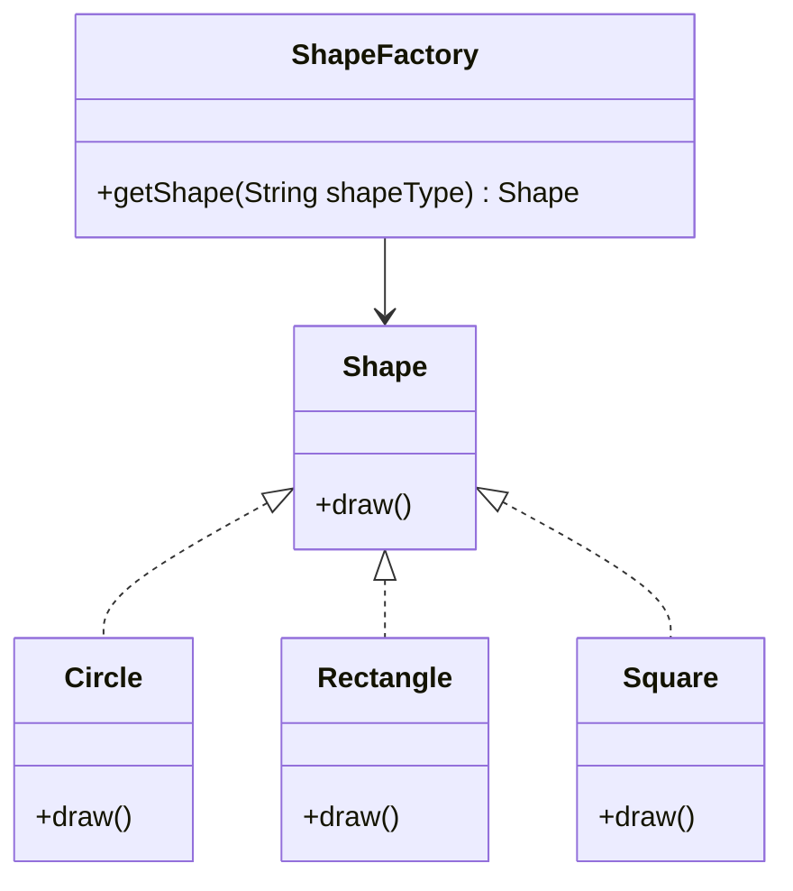

# Factory Pattern in Java

The Factory Pattern is one of the most used design patterns in Java.  
It belongs to the **Creational** design patterns category and provides one of the best ways to create objects.

---

## 📖 Intent
- Create objects without exposing the creation logic to the client.
- Use a common interface to refer to newly created objects.

---

## 📂 Implementation Steps

### Step 1: Create an interface
**Shape.java**
```java
public interface Shape {
   void draw();
}
```

### Step 2: Create concrete classes implementing the same interface
**Rectangle.java**
```java
public class Rectangle implements Shape {
   @Override
   public void draw() {
      System.out.println("Inside Rectangle::draw() method.");
   }
}
```

**Square.java**
```java
public class Square implements Shape {
   @Override
   public void draw() {
      System.out.println("Inside Square::draw() method.");
   }
}
```

**Circle.java**
```java
public class Circle implements Shape {
   @Override
   public void draw() {
      System.out.println("Inside Circle::draw() method.");
   }
}
```

---

### Step 3: Create a Factory to generate objects based on given information
**ShapeFactory.java**
```java
public class ShapeFactory {
   //use getShape method to get object of type shape 
   public Shape getShape(String shapeType){
      if(shapeType == null){
         return null;
      }		
      if(shapeType.equalsIgnoreCase("CIRCLE")){
         return new Circle();
      } else if(shapeType.equalsIgnoreCase("RECTANGLE")){
         return new Rectangle();
      } else if(shapeType.equalsIgnoreCase("SQUARE")){
         return new Square();
      }
      return null;
   }
}
```

---

### Step 4: Use the Factory to get objects by passing information such as type
**FactoryPatternDemo.java**
```java
public class FactoryPatternDemo {
   public static void main(String[] args) {
      ShapeFactory shapeFactory = new ShapeFactory();

      //get an object of Circle and call its draw method.
      Shape shape1 = shapeFactory.getShape("CIRCLE");
      shape1.draw();

      //get an object of Rectangle and call its draw method.
      Shape shape2 = shapeFactory.getShape("RECTANGLE");
      shape2.draw();

      //get an object of Square and call its draw method.
      Shape shape3 = shapeFactory.getShape("SQUARE");
      shape3.draw();
   }
}
```

---

## 🖥️ Output
```
Inside Circle::draw() method.
Inside Rectangle::draw() method.
Inside Square::draw() method.
```

---

## 📊 UML Diagram (Mermaid)

