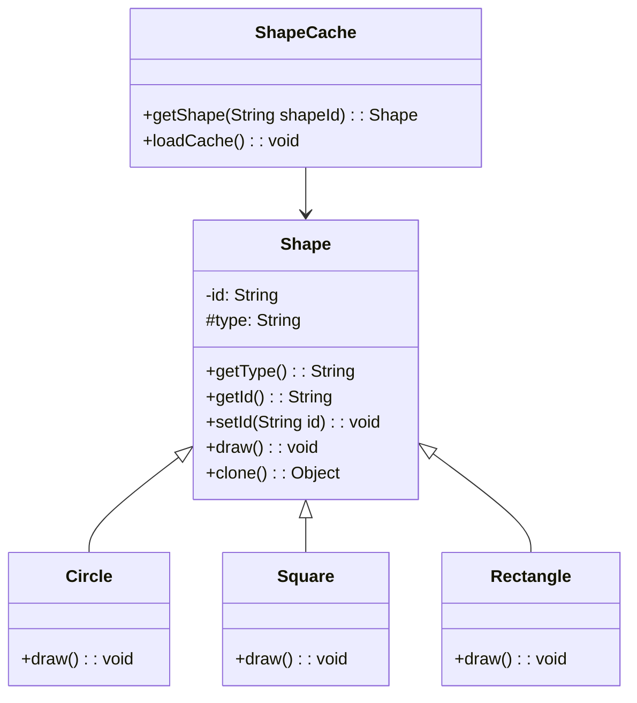

# Prototype Pattern

Prototype pattern refers to creating duplicate objects while keeping performance in mind. 
This type of design pattern comes under **creational pattern** as it provides one of the best ways to create an object.

This pattern involves implementing a prototype interface which tells to create a clone of the current object. 
It is used when creating the object directly is costly. 

---

## UML Diagram


---

## Step 1: Create Abstract Class

**Shape.java**
```java
public abstract class Shape implements Cloneable {
   
   private String id;
   protected String type;
   
   abstract void draw();
   
   public String getType(){
      return type;
   }
   
   public String getId() {
      return id;
   }
   
   public void setId(String id) {
      this.id = id;
   }
   
   public Object clone() {
      Object clone = null;
      try {
         clone = super.clone();
      } catch (CloneNotSupportedException e) {
         e.printStackTrace();
      }
      return clone;
   }
}
```

---

## Step 2: Create Concrete Classes

**Rectangle.java**
```java
public class Rectangle extends Shape {
   public Rectangle(){ type = "Rectangle"; }
   @Override
   public void draw() { System.out.println("Inside Rectangle::draw() method."); }
}
```

**Square.java**
```java
public class Square extends Shape {
   public Square(){ type = "Square"; }
   @Override
   public void draw() { System.out.println("Inside Square::draw() method."); }
}
```

**Circle.java**
```java
public class Circle extends Shape {
   public Circle(){ type = "Circle"; }
   @Override
   public void draw() { System.out.println("Inside Circle::draw() method."); }
}
```

---

## Step 3: Create ShapeCache

**ShapeCache.java**
```java
import java.util.Hashtable;

public class ShapeCache {
	
   private static Hashtable<String, Shape> shapeMap  = new Hashtable<String, Shape>();

   public static Shape getShape(String shapeId) {
      Shape cachedShape = shapeMap.get(shapeId);
      return (Shape) cachedShape.clone();
   }

   public static void loadCache() {
      Circle circle = new Circle();
      circle.setId("1");
      shapeMap.put(circle.getId(),circle);

      Square square = new Square();
      square.setId("2");
      shapeMap.put(square.getId(),square);

      Rectangle rectangle = new Rectangle();
      rectangle.setId("3");
      shapeMap.put(rectangle.getId(), rectangle);
   }
}
```

---

## Step 4: Demo Class

**PrototypePatternDemo.java**
```java
public class PrototypePatternDemo {
   public static void main(String[] args) {
      ShapeCache.loadCache();

      Shape clonedShape = (Shape) ShapeCache.getShape("1");
      System.out.println("Shape : " + clonedShape.getType());		

      Shape clonedShape2 = (Shape) ShapeCache.getShape("2");
      System.out.println("Shape : " + clonedShape2.getType());		

      Shape clonedShape3 = (Shape) ShapeCache.getShape("3");
      System.out.println("Shape : " + clonedShape3.getType());		
   }
}
```

---

## Step 5: Output

```
Shape : Circle
Shape : Square
Shape : Rectangle
```
