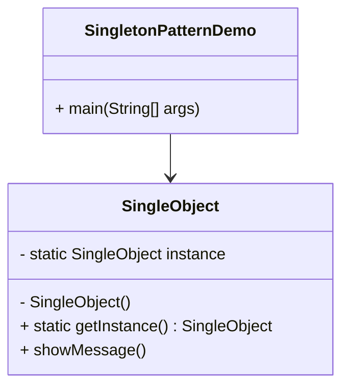

# 🟢 Singleton Pattern 

The **Singleton Pattern** is one of the simplest design patterns in Java.  
It ensures that **only one instance of a class** exists in the entire application and provides a **global point of access** to it.

---

## 📖 Definition
- Belongs to the **Creational Design Patterns**.
- Ensures **controlled access** to a single object.
- Useful when exactly one object is needed to coordinate actions across the system.

---

## 🏗️ UML Diagram (Mermaid)


---

## 💻 Implementation

### Step 1: Create a Singleton Class
```java
public class SingleObject {

   // Create a single instance of the class
   private static SingleObject instance = new SingleObject();

   // Make the constructor private so no other class can instantiate it
   private SingleObject(){}

   // Provide a global point of access
   public static SingleObject getInstance(){
      return instance;
   }

   public void showMessage(){
      System.out.println("Hello World!");
   }
}
```

---

### Step 2: Access the Singleton Object
```java
public class SingletonPatternDemo {
   public static void main(String[] args) {

      // Illegal construct: Compile Time Error
      // SingleObject object = new SingleObject();

      // Get the only object available
      SingleObject object = SingleObject.getInstance();

      // Show message
      object.showMessage();
   }
}
```

---

### Step 3: Verify Output
```
Hello World!
```

---

## ✅ Key Points
- Ensures **single instance** throughout the app.
- Provides **global access**.
- Constructor is **private** to prevent direct instantiation.

---