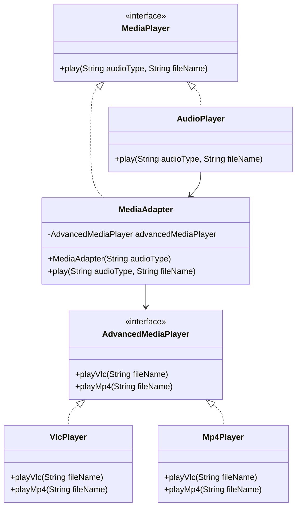

# Adapter Design Pattern (Obsidian Notes)

## 📌 Intent
The **Adapter Pattern** is a structural design pattern that allows incompatible interfaces to work together.  
It acts as a **bridge** between two interfaces.

In this example:
- `AudioPlayer` can play `mp3` files directly.
- For `vlc` and `mp4` files, it uses an **adapter (`MediaAdapter`)** that translates the request to `AdvancedMediaPlayer` implementations.
- This allows the system to **extend support** for new formats without changing the client code.

---

## 🏗 Class Diagram (Mermaid)


---

## 💻 Example Code

### Main.java
```java
import MediaPlayer.AudioPlayer;

public class Main {
    public static void main(String[] args) {
        AudioPlayer audioPlayer = new AudioPlayer();

        audioPlayer.play("mp3", "beyond the horizon.mp3");
        audioPlayer.play("mp4", "alone.mp4");
        audioPlayer.play("vlc", "far far away.vlc");
        audioPlayer.play("avi", "mind me.avi");
    }
}
```

### MediaPlayer.java
```java
package MediaPlayer;

public interface MediaPlayer {
    void play(String audioType, String fileName);
}
```

### MediaAdapter.java
```java
package MediaPlayer;

import AdvancedMediaPlayer.*;

public class MediaAdapter implements MediaPlayer {
    private AdvancedMediaPlayer advancedMediaPlayer;

    MediaAdapter(String audioType) {
        if (audioType.equalsIgnoreCase("vlc")) {
            advancedMediaPlayer = new VlcPlayer();
        } else if (audioType.equalsIgnoreCase("mp4")) {
            advancedMediaPlayer = new Mp4Player();
        }
    }

    @Override
    public void play(String audioType, String fileName) {
        if (audioType.equalsIgnoreCase("vlc")) {
            advancedMediaPlayer.playVlc(fileName);
        } else if (audioType.equalsIgnoreCase("mp4")) {
            advancedMediaPlayer.playMp4(fileName);
        }
    }
}
```

### AdvancedMediaPlayer.java
```java
package AdvancedMediaPlayer;

public interface AdvancedMediaPlayer {
    void playVlc(String fileName);
    void playMp4(String fileName);
}
```

### VlcPlayer.java
```java
package AdvancedMediaPlayer;

public class VlcPlayer implements AdvancedMediaPlayer {
    @Override
    public void playVlc(String fileName) {
        System.out.println("Playing vlc file: " + fileName);
    }

    @Override
    public void playMp4(String fileName) {
        // do nothing
    }
}
```

### Mp4Player.java
```java
package AdvancedMediaPlayer;

public class Mp4Player implements AdvancedMediaPlayer {
    @Override
    public void playVlc(String fileName) {
        // do nothing
    }

    @Override
    public void playMp4(String fileName) {
        System.out.println("Playing mp4 file: " + fileName);
    }
}
```

### AudioPlayer.java
```java
package MediaPlayer;

public class AudioPlayer implements MediaPlayer {

    MediaAdapter mediaAdapter;

    @Override
    public void play(String audioType, String fileName) {
        if (audioType.equalsIgnoreCase("mp3")) {
            System.out.println("Playing mp3 file: " + fileName);
        }
        else if (audioType.equalsIgnoreCase("vlc") || audioType.equalsIgnoreCase("mp4")) {
            mediaAdapter = new MediaAdapter(audioType);
            mediaAdapter.play(audioType, fileName);
        }
        else {
            System.out.println("Invalid media. " + audioType + " format not supported");
        }
    }
}
```

---

## ✅ Key Points
- The **Adapter** (`MediaAdapter`) makes two incompatible interfaces (`MediaPlayer` and `AdvancedMediaPlayer`) work together.
- The **Client** (`Main`) is unaware of the adapter logic, it just calls `audioPlayer.play(...)`.
- This pattern follows the **Open/Closed Principle**: we can add new formats by adding new `AdvancedMediaPlayer` implementations without changing client code.

