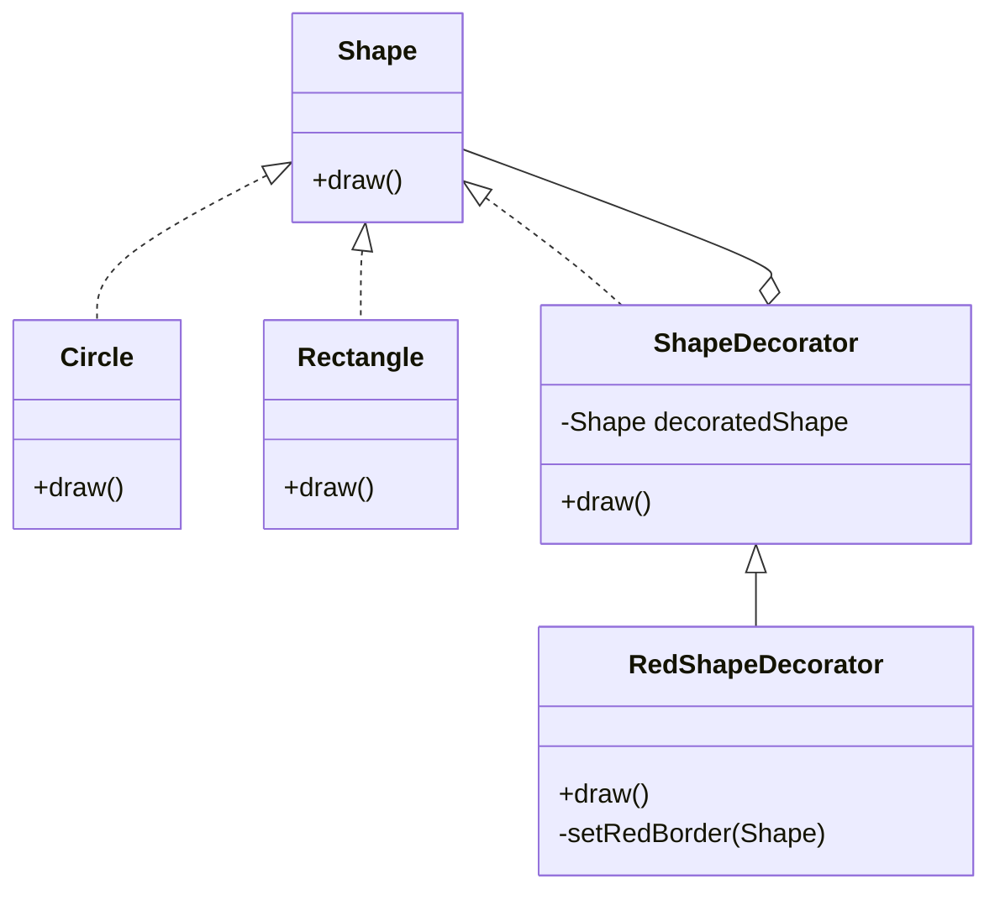

# 🎨 Decorator Design Pattern

## 📖 Intent
The **Decorator pattern** allows behavior to be added to individual objects, dynamically, without modifying the class itself.  
It’s a **structural design pattern** because it acts as a **wrapper** around existing classes.

---

## 📂 Structure
- **Component** → `Shape` (interface)
- **Concrete Components** → `Circle`, `Rectangle`
- **Decorator (abstract)** → `ShapeDecorator`
- **Concrete Decorator** → `RedShapeDecorator`

---

## 📊 UML (Mermaid)



---

## 🛠 Implementation

### Step 1: Create the Component (interface)
```java
public interface Shape {
   void draw();
}
```

### Step 2: Concrete Components
```java
public class Rectangle implements Shape {
   @Override
   public void draw() {
      System.out.println("Shape: Rectangle");
   }
}

public class Circle implements Shape {
   @Override
   public void draw() {
      System.out.println("Shape: Circle");
   }
}
```

### Step 3: Abstract Decorator
```java
public abstract class ShapeDecorator implements Shape {
   protected Shape decoratedShape;

   public ShapeDecorator(Shape decoratedShape){
      this.decoratedShape = decoratedShape;
   }

   public void draw(){
      decoratedShape.draw();
   }
}
```

### Step 4: Concrete Decorator
```java
public class RedShapeDecorator extends ShapeDecorator {

   public RedShapeDecorator(Shape decoratedShape) {
      super(decoratedShape);
   }

   @Override
   public void draw() {
      decoratedShape.draw();
      setRedBorder(decoratedShape);
   }

   private void setRedBorder(Shape decoratedShape){
      System.out.println("Border Color: Red");
   }
}
```

### Step 5: Demo
```java
public class DecoratorPatternDemo {
   public static void main(String[] args) {
      Shape circle = new Circle();

      Shape redCircle = new RedShapeDecorator(new Circle());
      Shape redRectangle = new RedShapeDecorator(new Rectangle());

      System.out.println("Circle with normal border");
      circle.draw();

      System.out.println("\nCircle of red border");
      redCircle.draw();

      System.out.println("\nRectangle of red border");
      redRectangle.draw();
   }
}
```

---

## ✅ Output
```
Circle with normal border
Shape: Circle

Circle of red border
Shape: Circle
Border Color: Red

Rectangle of red border
Shape: Rectangle
Border Color: Red
```

---

## 💡 Key Points
- **Open/Closed Principle**: Classes are open for extension but closed for modification.  
- Multiple decorators can be stacked dynamically.  
- Useful when adding responsibilities without creating complex inheritance trees.  

---

## 🌍 Real-World Analogy
Think of **decorating a pizza** 🍕:
- The **plain pizza** is the base `Shape`.  
- **Toppings (cheese, olives, pepperoni)** are **decorators** that add extra behavior.  
- You can mix and match toppings (decorators) without changing the base pizza recipe.  

Another analogy is a **photo editing app** 📸:
- The original **photo** is the base object.  
- Applying **filters (black & white, sepia, vignette)** are decorators that enhance the photo dynamically.  

---
