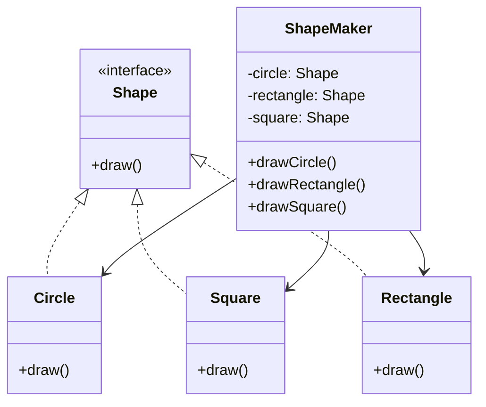

# Design Patterns - Facade Pattern

## Overview
The **Facade Pattern** hides the complexities of the system and provides an interface to the client using which the client can access the system.  

- **Category:** Structural Pattern  
- **Intent:** Adds a simplified interface to an existing system, making it easier to use.  
- **Key Idea:** Instead of exposing multiple complex classes directly, provide a facade that delegates to them internally.  

---

## UML Diagram (Mermaid)



---

## Implementation

### Step 1: Create an Interface
```java
// Shape.java
public interface Shape {
   void draw();
}
```

### Step 2: Create Concrete Classes
```java
// Rectangle.java
public class Rectangle implements Shape {
   @Override
   public void draw() {
      System.out.println("Rectangle::draw()");
   }
}

// Square.java
public class Square implements Shape {
   @Override
   public void draw() {
      System.out.println("Square::draw()");
   }
}

// Circle.java
public class Circle implements Shape {
   @Override
   public void draw() {
      System.out.println("Circle::draw()");
   }
}
```

### Step 3: Create the Facade Class
```java
// ShapeMaker.java
public class ShapeMaker {
   private Shape circle;
   private Shape rectangle;
   private Shape square;

   public ShapeMaker() {
      circle = new Circle();
      rectangle = new Rectangle();
      square = new Square();
   }

   public void drawCircle() {
      circle.draw();
   }
   public void drawRectangle() {
      rectangle.draw();
   }
   public void drawSquare() {
      square.draw();
   }
}
```

### Step 4: Use the Facade
```java
// FacadePatternDemo.java
public class FacadePatternDemo {
   public static void main(String[] args) {
      ShapeMaker shapeMaker = new ShapeMaker();

      shapeMaker.drawCircle();
      shapeMaker.drawRectangle();
      shapeMaker.drawSquare();
   }
}
```

### Step 5: Output
```
Circle::draw()
Rectangle::draw()
Square::draw()
```

---

## Advantages
- Simplifies usage of complex systems.  
- Reduces coupling between clients and subsystems.  
- Makes code more readable and maintainable.  

## Disadvantages
- Can become a **god object** if the facade grows too much.  
- May hide too much functionality, limiting flexibility.  

---

## Real-World Examples
- **GUI Libraries:** A windowing system provides a simplified API to complex OS-level drawing routines.  
- **Database Access:** A DAO or Repository class hides the complexity of SQL queries.  
- **Java `javax.faces.context.FacesContext`:** Provides a facade to multiple JSF subsystems.  

---

## Quiz
1. What type of design pattern is Facade?  
2. What is the main purpose of the Facade pattern?  
3. What class in our example plays the role of the Facade?  
4. Name two advantages of using Facade.  
