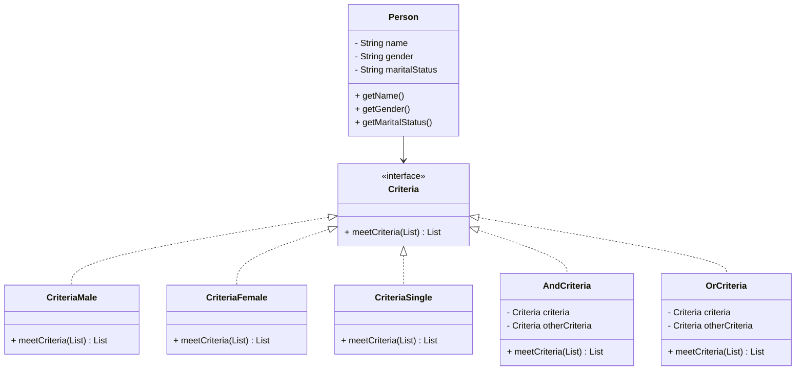

# Filter (Criteria) Design Pattern in Java

The **Filter Pattern** (also known as the **Criteria Pattern**) is a structural pattern that enables developers to filter objects using different criteria and chaining them together through logical operations such as **AND** and **OR**.

---

## Structure

- **Model (`Person`)**
    - Defines the object to be filtered (with attributes like name, gender, marital status).

- **Criteria (Interface)**
    - Defines a method `meetCriteria` that filters a list of persons.

- **Concrete Criteria Classes**
    - Implement specific filtering rules, e.g., `CriteriaMale`, `CriteriaFemale`, `CriteriaSingle`.

- **Composite Criteria**
    - Allow combining multiple criteria using **AND** or **OR** operations.

---

## UML (Mermaid Diagram)



---

## Java Implementation

### Model

```java
package Person;

public class Person {
    private final String name;
    private final String gender;
    private final String maritalStatus;

    public Person(String name, String gender, String maritalStatus) {
        this.name = name;
        this.gender = gender;
        this.maritalStatus = maritalStatus;
    }

    public String getName() {
        return this.name;
    }

    public String getGender() {
        return gender;
    }

    public String getMaritalStatus() {
        return maritalStatus;
    }
}
```

### Criteria Interface

```java
package Criteria;
import Person.Person;
import java.util.*;

public interface Criteria {
    List<Person> meetCriteria(List<Person> people);
}
```

### Concrete Criteria

```java
package Criteria;
import Person.Person;
import java.util.*;

public class CriteriaMale implements Criteria {
    @Override
    public List<Person> meetCriteria(List<Person> people) {
        List<Person> males = new ArrayList<>();
        for (Person person : people) {
            if (person.getGender().equalsIgnoreCase("Male")) {
                males.add(person);
            }
        }
        return males;
    }
}
```

```java
package Criteria;
import Person.Person;
import java.util.*;

public class CriteriaFemale implements Criteria {
    @Override
    public List<Person> meetCriteria(List<Person> people) {
        List<Person> females = new ArrayList<>();
        for (Person person : people) {
            if (person.getGender().equalsIgnoreCase("Female")) {
                females.add(person);
            }
        }
        return females;
    }
}
```

```java
package Criteria;
import Person.Person;
import java.util.*;

public class CriteriaSingle implements Criteria {
    @Override
    public List<Person> meetCriteria(List<Person> people) {
        List<Person> singles = new ArrayList<>();
        for (Person person : people) {
            if (person.getMaritalStatus().equalsIgnoreCase("Single")) {
                singles.add(person);
            }
        }
        return singles;
    }
}
```

### Composite Criteria

```java
package Criteria;
import Person.Person;
import java.util.*;

public class AndCriteria implements Criteria {
    private Criteria criteria;
    private Criteria otherCriteria;

    public AndCriteria(Criteria criteria, Criteria otherCriteria) {
        this.criteria = criteria;
        this.otherCriteria = otherCriteria;
    }

    @Override
    public List<Person> meetCriteria(List<Person> people) {
        List<Person> firstCriteria = criteria.meetCriteria(people);
        return otherCriteria.meetCriteria(firstCriteria);
    }
}
```

```java
package Criteria;
import Person.Person;
import java.util.*;

public class OrCriteria implements Criteria {
    private Criteria criteria;
    private Criteria otherCriteria;

    public OrCriteria(Criteria criteria, Criteria otherCriteria) {
        this.criteria = criteria;
        this.otherCriteria = otherCriteria;
    }

    @Override
    public List<Person> meetCriteria(List<Person> people) {
        List<Person> firstCriteria = criteria.meetCriteria(people);
        List<Person> otherCriteriaItems = otherCriteria.meetCriteria(people);

        for (Person person : otherCriteriaItems) {
            if (!firstCriteria.contains(person)) {
                firstCriteria.add(person);
            }
        }
        return firstCriteria;
    }
}
```

### Client

```java
import Person.Person;
import Criteria.*;
import java.util.*;

public class Main {
    public static void main(String[] args) {
        List<Person> persons = new ArrayList<Person>();
        persons.add(new Person("Mego 5wal", "Female", "Single"));
        persons.add(new Person("Ahmed", "Male", "Married"));
        persons.add(new Person("Ramage", "Female", "Single"));
        persons.add(new Person("Omnia", "Female", "Married"));
        persons.add(new Person("Abdallah", "Male", "Single"));
        persons.add(new Person("Mohamed", "Male", "Married"));

        Criteria criteria = new OrCriteria(new CriteriaFemale(), new CriteriaSingle());
        List<Person> result = criteria.meetCriteria(persons);

        for (final Person person : result) {
            System.out.println(
                "Name: " + person.getName() + 
                ", Gender: " + person.getGender() + 
                ", Marital Status: " + person.getMaritalStatus()
            );
        }
    }
}
```

---

## Example Output

```
Name: Mego 5wal, Gender: Female, Marital Status: Single
Name: Ahmed, Gender: Male, Marital Status: Married
Name: Ramage, Gender: Female, Marital Status: Single
Name: Omnia, Gender: Female, Marital Status: Married
Name: Abdallah, Gender: Male, Marital Status: Single
```

---

## Benefits

- Provides a clean way to **filter objects** using different criteria.
- Makes criteria reusable and composable (**AND**, **OR** logic).
- Avoids hardcoding filtering logic inside the main program.

---

## When to Use

- When you need to filter a set of objects based on different conditions.
- When conditions can change dynamically or be combined flexibly.

---