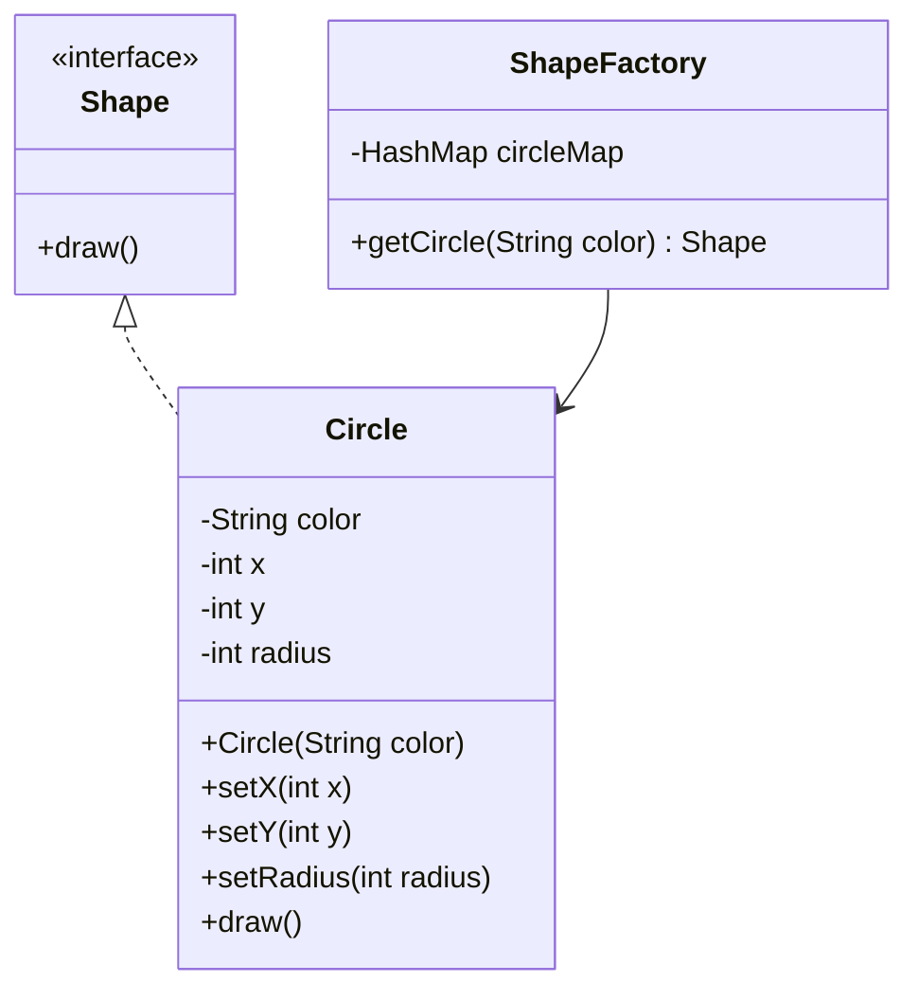

# Design Patterns - Flyweight Pattern

## Overview
The **Flyweight Pattern** is primarily used to **reduce the number of objects created**, decrease memory footprint, and increase performance.  

- **Category:** Structural Pattern  
- **Intent:** Reuse already existing objects by storing them, and create new ones only when necessary.  
- **Key Idea:** Use shared objects to support a large number of fine-grained objects efficiently.  

---

## UML Diagram (Mermaid)



---

## Implementation

### Step 1: Create an Interface
```java
// Shape.java
public interface Shape {
   void draw();
}
```

### Step 2: Create Concrete Class
```java
// Circle.java
public class Circle implements Shape {
   private String color;
   private int x;
   private int y;
   private int radius;

   public Circle(String color){
      this.color = color;		
   }

   public void setX(int x) {
      this.x = x;
   }

   public void setY(int y) {
      this.y = y;
   }

   public void setRadius(int radius) {
      this.radius = radius;
   }

   @Override
   public void draw() {
      System.out.println("Circle: Draw() [Color : " + color +
         ", x : " + x + ", y :" + y + ", radius :" + radius);
   }
}
```

### Step 3: Create the Factory
```java
// ShapeFactory.java
import java.util.HashMap;

public class ShapeFactory {
   private static final HashMap circleMap = new HashMap();

   public static Shape getCircle(String color) {
      Circle circle = (Circle)circleMap.get(color);

      if(circle == null) {
         circle = new Circle(color);
         circleMap.put(color, circle);
         System.out.println("Creating circle of color : " + color);
      }
      return circle;
   }
}
```

### Step 4: Use the Factory
```java
// FlyweightPatternDemo.java
public class FlyweightPatternDemo {
   private static final String colors[] = { "Red", "Green", "Blue", "White", "Black" };
   public static void main(String[] args) {

      for(int i=0; i < 20; ++i) {
         Circle circle = (Circle)ShapeFactory.getCircle(getRandomColor());
         circle.setX(getRandomX());
         circle.setY(getRandomY());
         circle.setRadius(100);
         circle.draw();
      }
   }
   private static String getRandomColor() {
      return colors[(int)(Math.random()*colors.length)];
   }
   private static int getRandomX() {
      return (int)(Math.random()*100 );
   }
   private static int getRandomY() {
      return (int)(Math.random()*100);
   }
}
```

### Step 5: Sample Output
```
Creating circle of color : Black
Circle: Draw() [Color : Black, x : 36, y :71, radius :100
Creating circle of color : Green
Circle: Draw() [Color : Green, x : 27, y :27, radius :100
Creating circle of color : White
Circle: Draw() [Color : White, x : 64, y :10, radius :100
Creating circle of color : Red
Circle: Draw() [Color : Red, x : 15, y :44, radius :100
...
```

---

## Advantages
- Reduces memory usage by reusing existing objects.  
- Improves performance in applications with many repeated objects.  

## Disadvantages
- Complex to implement if many attributes must be externalized.  
- May make code harder to read due to object sharing.  

---

## Real-World Examples
- **Java String Pool:** Strings are reused instead of recreated.  
- **GUI Icons:** Same icon reused across multiple windows.  
- **Document Editors:** Characters or glyphs are shared instead of creating a new object for each.  

---

## Quiz
1. What is the primary goal of the Flyweight pattern?  
2. In this example, which property is used to decide whether to reuse an object?  
3. What design pattern category does Flyweight belong to?  
4. Name a real-world example of Flyweight.  
