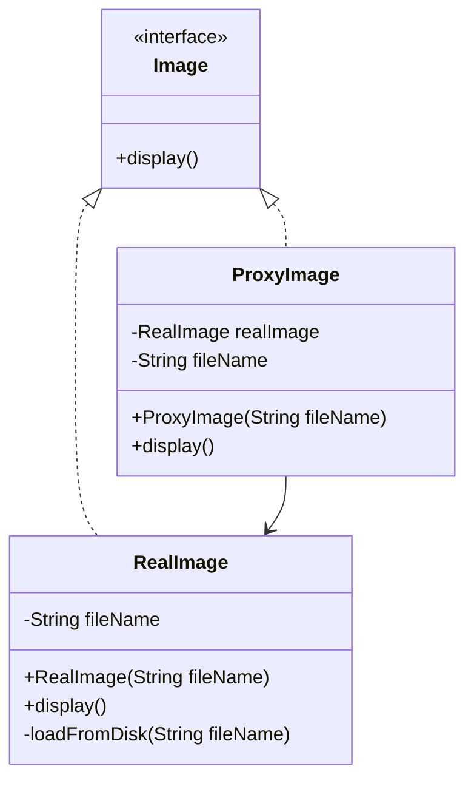

# Design Patterns - Proxy Pattern

## Overview
The **Proxy Pattern** provides a surrogate or placeholder for another object to control access to it.  

- **Category:** Structural Pattern  
- **Intent:** A class represents the functionality of another class, controlling its access.  
- **Key Idea:** Use a proxy object that implements the same interface as the real object, and delegates calls when necessary.  

---

## UML Diagram (Mermaid)



---

## Implementation

### Step 1: Create an Interface
```java
// Image.java
public interface Image {
   void display();
}
```

### Step 2: Create Concrete Classes
```java
// RealImage.java
public class RealImage implements Image {

   private String fileName;

   public RealImage(String fileName){
      this.fileName = fileName;
      loadFromDisk(fileName);
   }

   @Override
   public void display() {
      System.out.println("Displaying " + fileName);
   }

   private void loadFromDisk(String fileName){
      System.out.println("Loading " + fileName);
   }
}
```

```java
// ProxyImage.java
public class ProxyImage implements Image{

   private RealImage realImage;
   private String fileName;

   public ProxyImage(String fileName){
      this.fileName = fileName;
   }

   @Override
   public void display() {
      if(realImage == null){
         realImage = new RealImage(fileName);
      }
      realImage.display();
   }
}
```

### Step 3: Use the Proxy
```java
// ProxyPatternDemo.java
public class ProxyPatternDemo {
   public static void main(String[] args) {
      Image image = new ProxyImage("test_10mb.jpg");

      // image will be loaded from disk
      image.display();
      System.out.println("");

      // image will not be loaded from disk
      image.display();
   }
}
```

### Step 4: Output
```
Loading test_10mb.jpg
Displaying test_10mb.jpg

Displaying test_10mb.jpg
```

---

## Advantages
- Controls access to the real object.  
- Can reduce memory footprint by delaying object creation (lazy loading).  
- Useful for security, logging, caching, or remote access.  

## Disadvantages
- Adds extra layers of abstraction.  
- May increase response time due to delegation.  

---

## Real-World Examples
- **Virtual Proxy:** Loading images or files only when needed.  
- **Remote Proxy:** RMI in Java to represent an object in another JVM.  
- **Protection Proxy:** Controlling access to resources.  

---

## Quiz
1. What type of design pattern is Proxy?  
2. In the example, which class is the proxy?  
3. What advantage does ProxyImage provide over directly using RealImage?  
4. Name one real-world use case of Proxy.  
